# 1. css简介

概述

层叠样式表

语法规范

选择器 {属性:值;  属性:值;}

代码规范

1. 样式格式书写（展开） 2. 样式大小写（小写） 3. 空格规范（属性值前面，冒号后面，保留一个空格；选择器和大括号之间保留一个空格）

# 2. css基础选择器

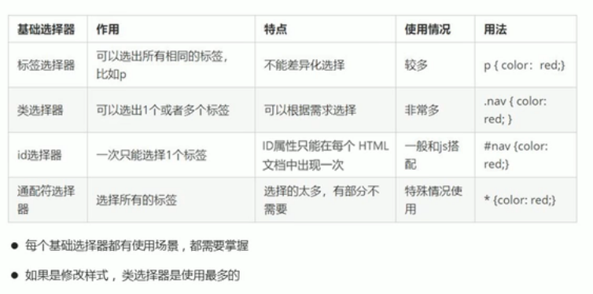

# 3. css字体属性

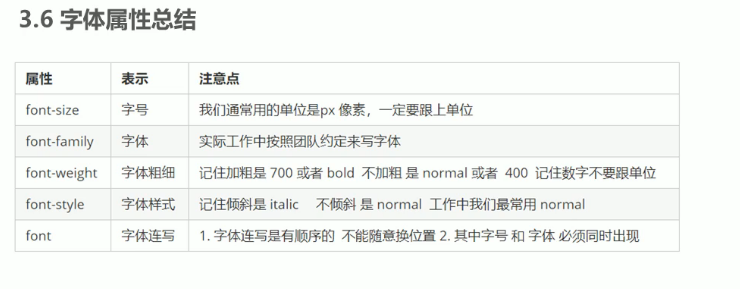

# 4. css文本属性

> 行间距的表示

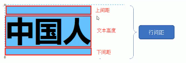

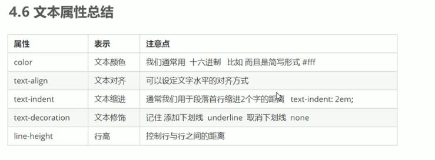

# 5. css引入方式

内部样式表  行内样式表 (内联样式表)    外部样式表

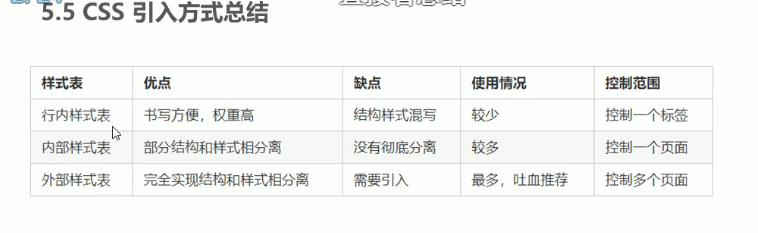


# 6. Emmet语法

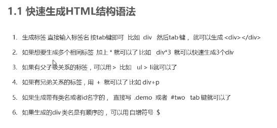

```html
.dev$*5
    <div class="dev1"></div>
    <div class="dev2"></div>
    <div class="dev3"></div>
    <div class="dev4"></div>
    <div class="dev5"></div>

div{三生三世十里桃花}
<div>三生三世十里桃花</div>

div{$}*5
    <div>1</div>
    <div>2</div>
    <div>3</div>
    <div>4</div>
    <div>5</div>
```

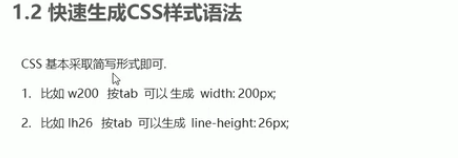

快速格式化代码

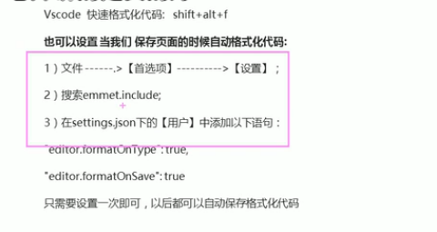


# 7. 复合选择器

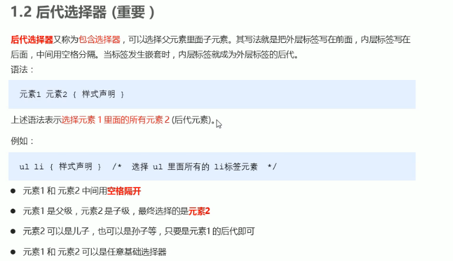


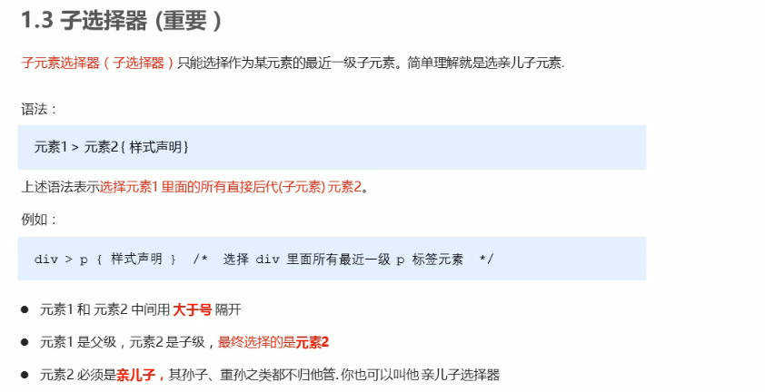


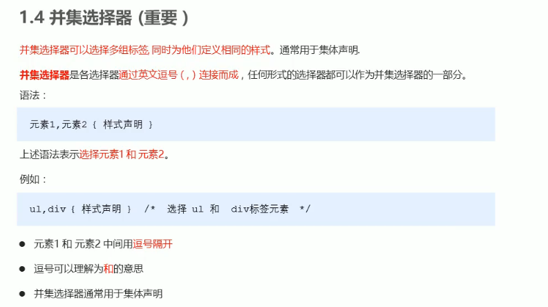


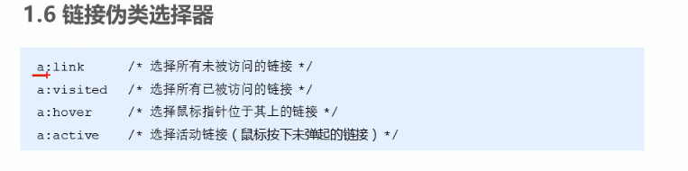

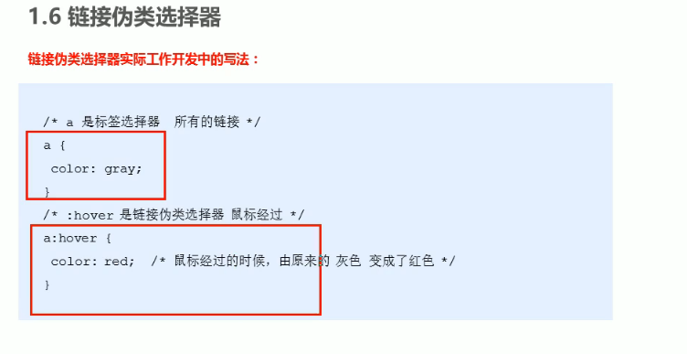

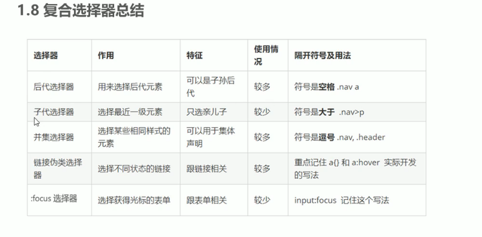

# 8. 元素显示模式

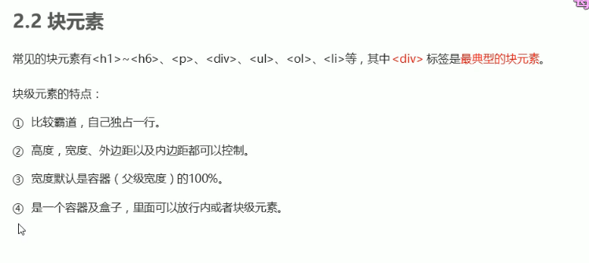

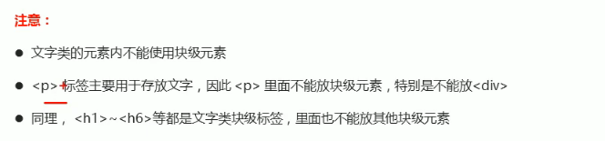

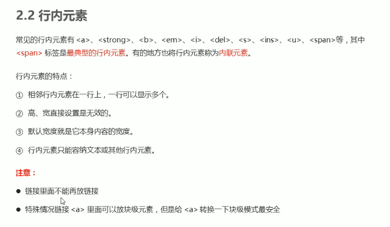


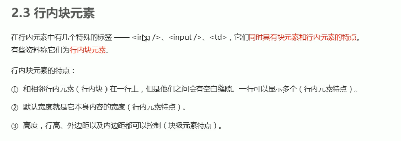

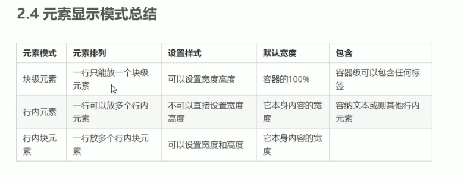

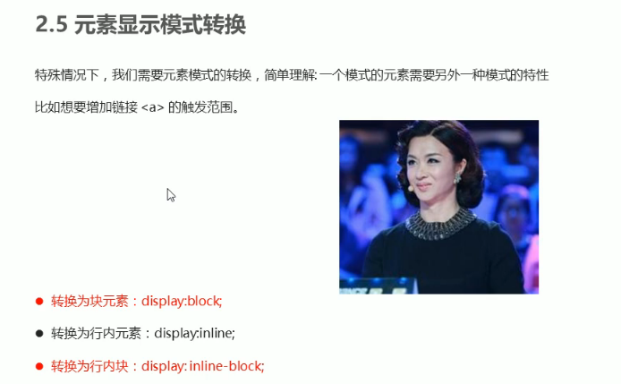

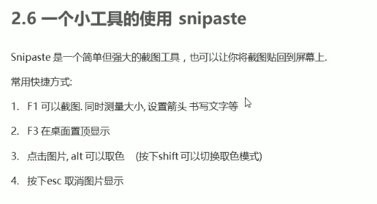

> 单行文字垂直居中的小技巧

让文字的高度等于盒子的高度


# 9. css的背景

> 背景颜色

> 背景图片

一般小图标或大图片用背景图片来设置，较容易调节位置

**源码剖析和框架定制能力**

**平台性能分析和调优能力**

**分布式架构设计能力**

**海量数据存储能力**

**高并发处理能力**

**解决方案和中间件实战能力**

**容器技术应用和集群化部署能力**

**海量数据搜索和实时计算能力** 

AGA