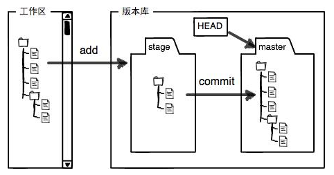

1. git简介

分布式版本控制系统，跟踪文本文件的改动。

2. 创建版本库

（1）选择一个合适的地方创建一个空目录，

（2）通过命令【git init】将该目录变成git可以管理的仓库。

3. 把文件添加到版本库中

（1）将文件放入仓库中；

（2）用命令【git add】把文件添加到仓库     git add 文件名；可反复多次使用，最后再一次性commit；

（3）用命令【git commit】把文件提交到仓库    git commit -m  “本次提交的说明”；

4. 随时掌握工作区的状态，使用【git status 】命令

5. 【git diff】查看修改的内容

6. 提交修改文件与提交新文件的步骤相同，需要 git add 和 git commit。

7. 版本回退

（1）在git中，使用『HEAD』表示当前版本，上一个版本即为『HEAD^』，上上一个版本就是『HEAD^^』，若是往上100个版本可写为HEAD～100；

（2）使用命令『git reset』进行版本回退 例如：git reset --hard HEAD^  git reset --hard commit_id
（3）用『git log 』可以查看提交历史，以便确定要回退的版本
（4）若要重返未来，可用『git reflog』查看每一次的命令历史，以便确定要回到未来的那个版本

8. 工作区和暂存区
（1）工作区：电脑能看到的目录
（2）版本库：工作区的一个隐藏目录 .git
（3）暂存区：版本库中的一个称为stage的东西；git add文件时就是将其添加到暂存区
（4）当前分支：版本库中git自动创建的第一个分支master以及指向master的一个指针HEAD

9. 管理修改
（1）git跟踪并管理的是修改而非文件，git commit只负责把暂存区的修改提交即只负责提交git add后的修改内容；
（2）git diff HEAD  --文件名 可查看工作区和版本库里面最新版本的区别。

10. 撤销修改
（1）git checkout  – –  文件名  丢弃工作区的修改，即回到最近一次的git add或git commit的状态
 (2) git reset HEAD 文件名   撤销暂存区的修改
场景1：若修改工作区某个文件的内容想直接丢弃，使用命令（1）
场景2：若修改工作区某个文件的内容并添加到了暂存区想直接丢弃，先用命令（2）再用命令（1）
场景3：若已经不合适的版本提交到版本库，则用版本回退的方法。

11. 删除文件
（1）从版本库中删除文件
 git rm 文件名   并  git commit  提交
（2）手动删除文件后发现删除错误
使用命令『git checkout – –  文件名』恢复，实质是用版本库里面的版本替换工作区的版本。

12. 创建远程仓库
步骤1：创建SSH Key，即用户主目录下的文件id_rsa和id_rsa.pub，分别对应私钥和公钥；
步骤2：登陆Github，打开Settings，SSH and GPG keys，点击 Add SSH Key，在key文本框中添加文件id_rsa.pub的内容

13. 添加远程仓库（先有本地库，后有远程库的时候如何关联）
（1）关联远程库
git remote add origin https://github.com/luolin1994/learngit.git
or   git remote add origin  git@github.com:luolin1994/learngit.git
（2）关联后，第一次推送master分支的所有内容
git push -u origin master
（3）此后，若本地作了提交，即可通过下述命令将本地master分支的最新修改推送至Github

14. 从远程库克隆（先创建远程库，再从远程库克隆）
（1）命令
    git clone https://github.com/luolin1994/gitskills.git
or git clone git@github.com:luolin1994/gitskills.git
（2）git支持多种协议，包括https，但通过ssh支持的原生git协议速度最快

15. 创建与合并分支
（1）分支的作用：可创建了一个属于自己的分支，别人看不到还继续在原来的分支上正常工作，而你在自己的分支上干活，想提交就提交，直到开发完毕后，再一次性合并到原来的分支上。
（2）查看当前的分支： 『git branch』
（3）创建分支：『git branch <name>』
（4）切换分支： 『git checkout <name>』
（5）创建并切换分支： 『git checkout -b <name>』
（6）合并某分支到当前分支

PATH=/usr/local/bin:/usr/local/sbin:/usr/bin:/usr/sbin:/bin:/sbin:/root/bin