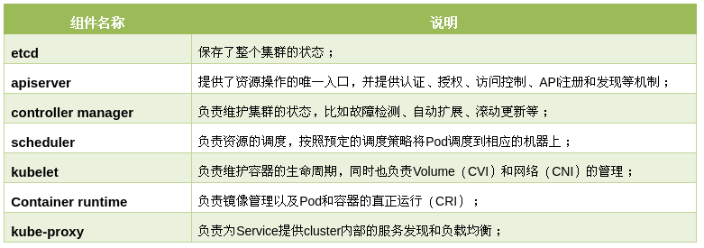
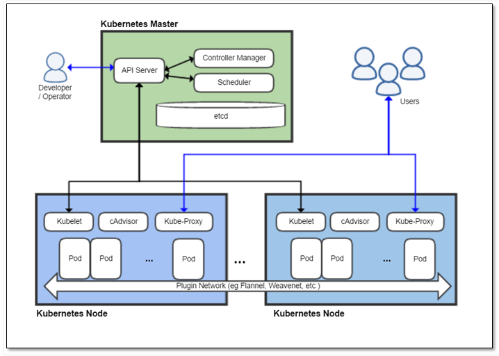

# 简介

## Kubernetes核心组件

Kubernetes主要由以下几个核心组件组成：



核心组件结构图:




# 集群部署

##  使用**kubeadm**部署

参考:  https://blog.csdn.net/weixin_44208042/article/details/90670008


> kubectl

是Kubernetes集群的命令行工具，通过kubectl能够对集群本身进行管理，并能够在集群上进行容器化应用的安装部署。

```shell
#  kubectl [command] [TYPE] [NAME] [flags]
# comand：指定要对资源执行的操作，例如create、get、describe和delete
# TYPE：指定资源类型，资源类TYPE：指定资源类型，资源类型是大小写敏感的，开发者能够以单数、复数和缩略的形式。
# NAME：指定资源的名称，名称也大小写敏感的。如果省略名称，则会显示所有的资源
# flags：指定可选的参数。例如，可以使用-s或者–server参数指定Kubernetes API server的地址和端口。
# 可以通过kubectl help命令获取更多的信息。

# 通过kubectl进行客户端命令测试，并借此了解集群组件的当前状态
root@hadoop-PC:/etc/kubernetes# kubectl get componentstatus
NAME                 STATUS    MESSAGE             ERROR
scheduler            Healthy   ok                  
controller-manager   Healthy   ok                  
etcd-0               Healthy   {"health":"true"}   

# 节点信息获取
root@hadoop-PC:~/k8s-uos# kubectl get nodes
NAME     STATUS   ROLES    AGE   VERSION
uos-pc   Ready    master   28h   v1.13.5-40+9d9161f9e24eb8-dirtyDeepin


# pod信息获取
root@hadoop-PC:~/k8s-uos# kubectl get pods --all-namespaces
NAMESPACE     NAME                             READY   STATUS    RESTARTS   AGE
kube-system   coredns-859fd9b8b5-5qv5m         1/1     Running   0          28h
kube-system   coredns-859fd9b8b5-b8s5d         1/1     Running   0          28h
kube-system   etcd-uos-pc                      1/1     Running   0          28h
kube-system   kube-apiserver-uos-pc            1/1     Running   0          28h
kube-system   kube-controller-manager-uos-pc   1/1     Running   0          28h
kube-system   kube-flannel-ds-sw64-cc72l       1/1     Running   0          27h
kube-system   kube-proxy-tf7pc                 1/1     Running   0          28h
kube-system   kube-scheduler-uos-pc            1/1     Running   0          28h

```

还有二进制安装, minikube安装,ansible部署等


# pod


# Labels和 Selectors

http://docs.kubernetes.org.cn/247.html

```shell
$ kubectl get pods -l environment=production,tier=frontend

$ kubectl get pods -l 'environment in (production),tier in (frontend)'
```


# Replication Controller(RC)

ReplicationController（简称RC）是确保用户定义的Pod副本数保持不变。


# ReplicaSet(RS)

ReplicaSet（RS）是Replication Controller（RC）的升级版本。ReplicaSet 和  Replication Controller之间的唯一区别是对选择器的支持。

ReplicaSet能确保运行指定数量的pod。


# Deployment

Deployment为Pod和Replica Set（升级版的 Replication Controller）提供声明式更新。

你只需要在 Deployment 中描述您想要的目标状态是什么，Deployment controller 就会帮您将 Pod 和ReplicaSet 的实际状态改变到您的目标状态。您可以定义一个全新的 Deployment 来创建 ReplicaSet 或者删除已有的 Deployment 并创建一个新的来替换。

# 服务（Service）

