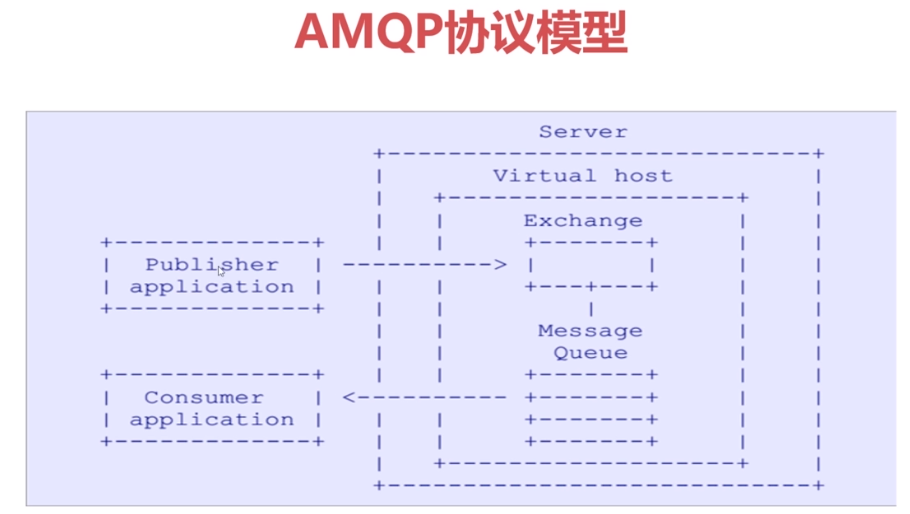
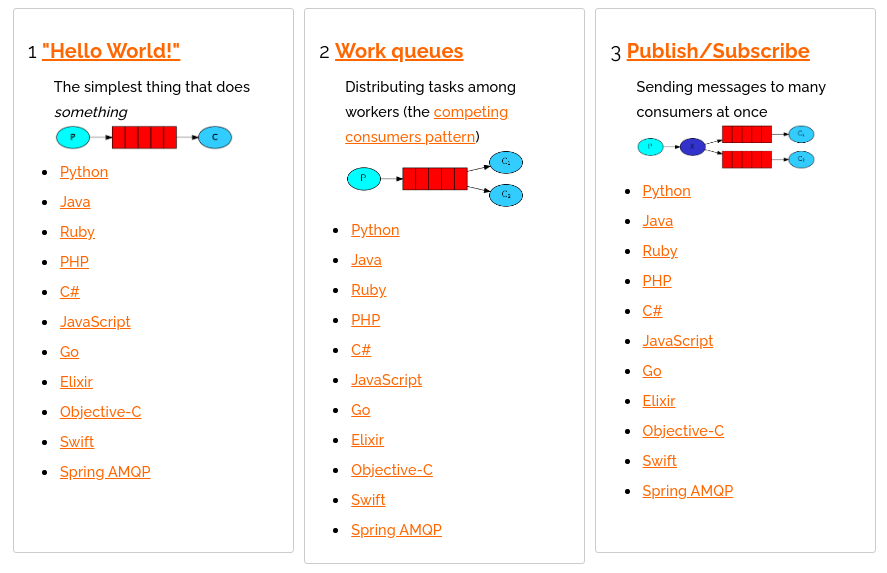
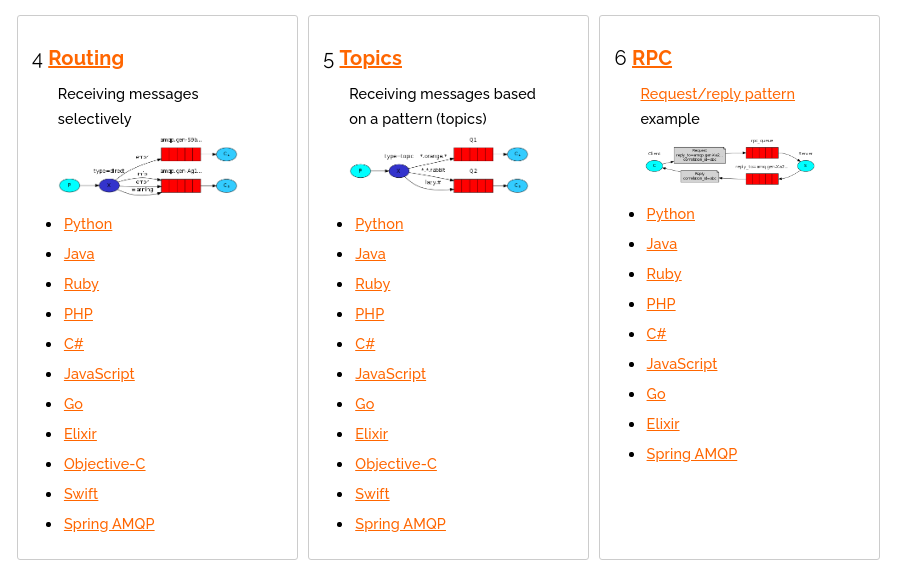
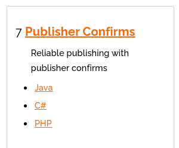
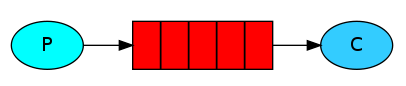

# 1. MQ引言

## 1.1 什么是MQ

消息队列，消息中间件

## 1.2 MQ有哪些

ActiveMQ,  RabbitMQ,  kafka,  RocketMQ等

## 1.3 不同MQ特点

```markdown
# 1. ActiveMQ
       ActiveMQ API丰富，集群架构模式丰富，成熟度较高，但是性能不高
       
 # 2. kafka
        性能非常高，用于大数据领域较多，追求效率，但是对消息的重复，丢失，错误没有严格要求
        
  # 3. RocketMQ
         性能不错，但是开源版本功能缺少
         
  # 4. RabbitMQ
        erlang语言开发， 基于AMQP协议来实现，支持多种业务场景；较容易与spring框架融合，对系统的一致性，稳定性，可靠性要求很高。性能不错，但是低与kafka
```


# 2. RabbitMQ的引言

## 2.1 RabbitMQ


```markdown
# AMQP协议
   高级消息传输协议
```



## 2.2  RabbitMQ的安装

安装教程： https://blog.csdn.net/LUCKWXF/article/details/104990113


# 3. RabbitMQ配置

## 3.1 管理命令行

```shell
#1. 服务启动相关
systemctl  start| stop | restart | status rabbitmq-server

#2. 管理命令行
  rabbitmqctl help  查看更多命令
  
#3. 插件管理命令行
rabbitmq-plugins enable| list| disable
```

## 3.2 web管理界面介绍


# 4. RabbitMQ的第一个程序

AMQP协议的回顾

设置虚拟主机，为用户配置可访问的虚拟主机

## 4.1 RabbitMQ支持的消息模型







## 4.2 引入依赖

```xml
<dependency>
    <groupId>com.rabbitmq</groupId>
    <artifactId>amqp-client</artifactId>
    <version>5.7.2</version>
</dependency>
```

api查询：https://rabbitmq.github.io/rabbitmq-java-client/api/current/

## 4.3 第一种模型（直连）



在上图的模型中，有以下概念：

+ p: 生产者，也就是要发送消息的程序
+ c: 消费者，消息的接收者，会一直等待消息的到来。
+ queue: 消息队列，类似一个邮箱，可以缓存消息，生产者向其中投递消息，消费者从其中取出消息

